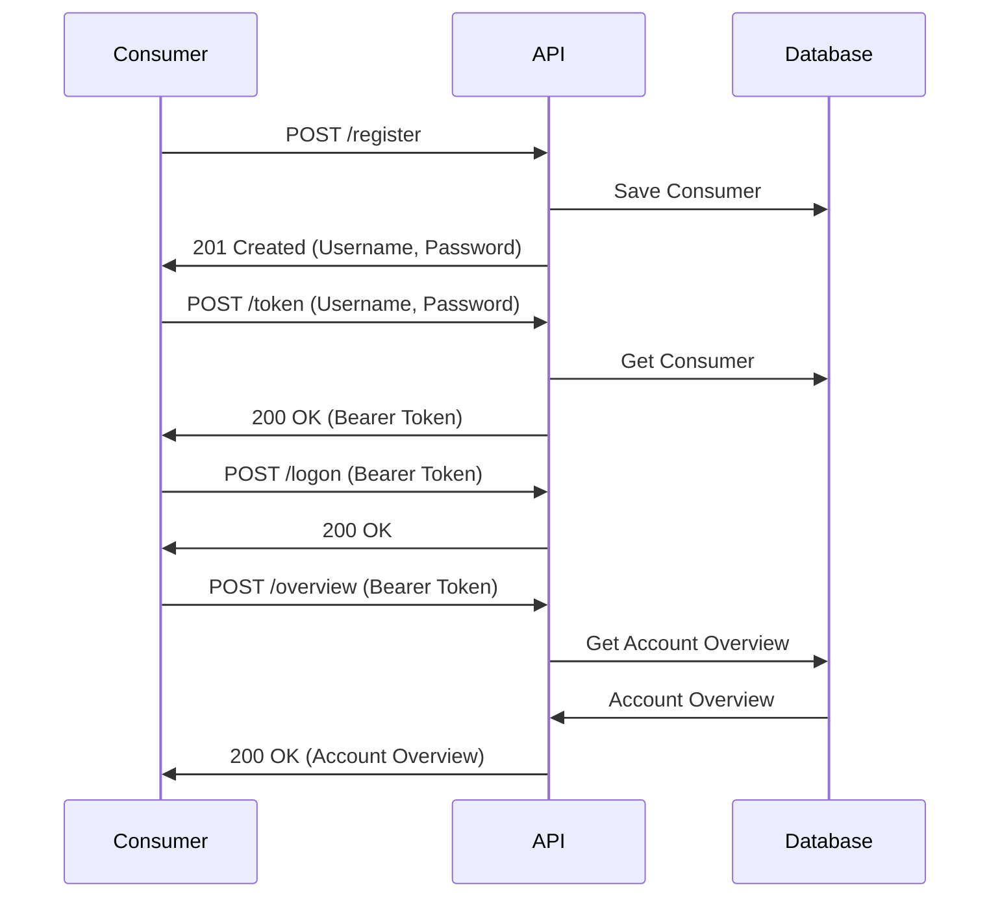
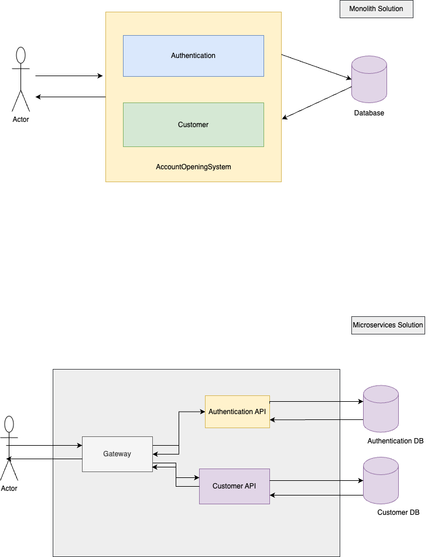

# Account Opening System

assessment project for account opening system

# Prerequisites

- Java 21
- Maven
- Docker
- Docker-compose

## Getting Started

### Clone the repository

```bash
git clone git@github.com:ayhanugurlu/AccountOpeningSystem.git
cd AccountOpeningSystem
```

To build the project, run the following command:

```bash
mvn clean install
```

or

```shell
./mvnw clean install
```

To run the project, run the following command:

```bash
mvn spring-boot:run
```

or

```shell
./mvnw spring-boot:run
```

Application will be running on http://localhost:8080
it has internal H2 database, If you want to use external postgresql database, you can change the configuration
via environment variables. You can find environment variables below.

```properties
SPRING_DATASOURCE_URL=jdbc:postgresql://{host}:{port}/{database}
SPRING_DATASOURCE_USERNAME={db_user}
SPRING_DATASOURCE_PASSWORD={db_password}
SPRING_JPA_DATABASE-PLATFORM=org.hibernate.dialect.PostgreSQLDialect
```

If you want to change country list, you can change the country list in the `application.properties` file or environment variables.

```properties
allowed.countries=NL,BEL,DE
```
```properties
ALLOWED_COUNTRIES=NL,BEL,DE
```

Application has rate limiting mechanism, you can change the rate limit configuration via environment variables.

```properties
rate.limit=2
rate.limit.period=1 // in seconds
```
```properties
RATE_LIMIT=10 
RATE_LIMIT_PERIOD=1 // in seconds
```


To run the project with docker, run the following command:

```bash
docker-compose up
```

## API Documentation

There are two ways to access the API documentation:

- Swagger UI: http://localhost:8080/swagger-ui.html
    - You can test the API endpoints using Swagger UI. It provides a user-friendly interface to interact with the API.
    - It supports bearer token authentication. You can get the token by calling the `/token` endpoint.
- Postman Collection: [AccountOpeningSystem.postman_collection.json](AccountOpeningSystem.postman_collection.json).
  Postman collection contains happy path scenarios. Because all other corner case tests are implemented in the unit
  tests and spring boot integration tests.
    - You can import the Postman collection into Postman and test the API endpoints.
    - It contains the following requests:
        - Register: Register a new consumer.
        - Token: Get the bearer token.
        - Logon: Logon with the bearer token.
        - Overview: Get the account overview.

## Sequence Diagram



## Design

Application has 3 layers:

- Controller Layer: It handles incoming HTTP requests and sends the response back to the client.
- Service Layer: It contains the business logic of the application.
- Repository Layer: It interacts with the database.

The application uses JWT for authentication. When a user registers, the application generates a JWT token and sends it
back to the user. The user can use this token to access the protected endpoints.

it is monolithic application, but it can be easily converted to microservices.
There are some improvements that can be done:

- Implementing a caching mechanism to reduce the number of database calls.
- Implementing a rate-limiting mechanism to prevent abuse of the API.
- Implementing a logging mechanism to log the requests and responses.
- Implementing a monitoring mechanism to monitor the health of the application.
- Implementing a circuit breaker mechanism to handle failures gracefully.
- Implementing a distributed tracing mechanism to trace the requests across services

You can find design diagram below.It also shows microservices architecture of the application.



